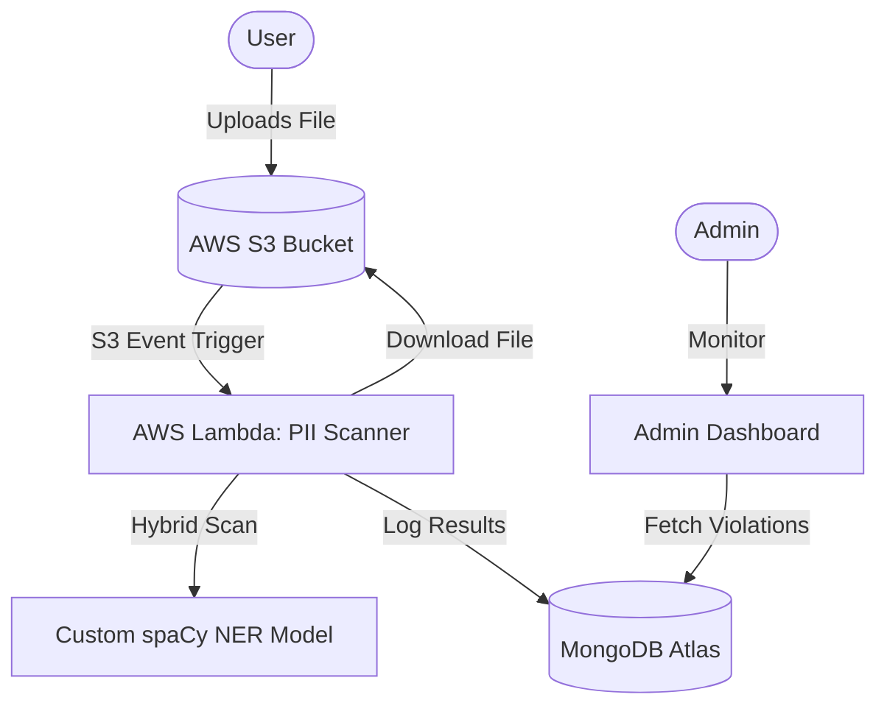

# 🔐 AI-Driven Privacy Auditor  
**MERN + AWS + NLP + OCR**

A cloud-powered platform that automatically detects and prevents **sensitive data leaks** (PII) such as  
📱 phone numbers, 🪪 IDs, 📍 locations, 📧 emails, and 🖼️ text hidden inside images.

Users upload text or files → AI inspects content → Flags violations → Admin gets alerts.

---

# 🧩 1. Problem Statement

With the increasing use of social platforms, people unintentionally upload sensitive information like:

- Phone numbers  
- Aadhar, PAN, Passport IDs  
- Addresses & geolocations  
- Vehicle numbers  
- Photos of documents  

This leads to:
- Privacy breaches  
- Identity theft  
- Fraud  
- Data misuse  
- Non-compliance with privacy laws (GDPR / India DPDP Act)

**There is no automated system that warns users *before* they accidentally leak private information.**

---

# 🎯 2. Our Solution

We built an **AI-powered privacy auditor** that:

### 🤖 1. Custom-Trained Indian PII NER Engine
- **Beyond Regex:** Uses a fine-tuned spaCy NER (Named Entity Recognition) model.
- **Specialized Detection:** Recognizes 9+ India-specific entities (Aadhar, PAN, Voter ID, Passport, IFSC, DL, UPI IDs).
- **Comprehensive Scans:** Detects:
  - 📱 **Phone numbers** (Indian format support)
  - 📧 **Emails** (Personal & Official)
  - 📍 **Locations** (GPE & Local)
  - 🪪 **Financial IDs** (PAN, Aadhar, IFSC)
  - 💳 **Digital IDs** (UPI ID, Voter ID, Passport)

### 📷 2. Image PII Extraction (OCR)
- Uses **Tesseract OCR** to extract text from image uploads (ID cards, screenshots, documents).
- Automatically scans extracted text for sensitive privacy violations using our hybrid engine.

### 🛡️ 3. Real-time Flagging & Redaction
- **Categorizes severity:** BLOCK (High Risk), WARN (Medium), ALLOW (Low).
- **Asynchronous Logging:** Logs every violation for administrative review.
- **Masking:** Automatically redacts PII in the UI (e.g., `XXXX XXXX 9012`).

### ☁️ 4. Event-Driven AWS Architecture
- **S3 Triggers:** Uploading a document to an S3 bucket automatically invokes a Lambda scan.
- **Serverless Scaling:** Uses **Containerized Lambdas** to handle large AI models efficiently without extra server load.
- **Infrastructure as Code:** Fully managed via **Terraform** for reproducible deployments.

---

# 🏗️ 3. System Architecture



---

# 🚀 4. Technical Highlights

- **ML Transfer Learning:** Fine-tuned `en_core_web_sm` on a synthetic dataset of 250+ annotated Indian PII examples.
- **Serverless Scaling:** Moved compute-intensive NLP/OCR tasks to AWS Lambda to reduce main server load.
- **Dockerized Environment:** Guaranteed consistency across local development and AWS Lambda using Docker.
- **Privacy-First Design:** Implemented robust PII masking and redaction rules.  

---

# 🧬 5. Tech Stack

### **Frontend**
- React 18  
- Vite  
- Context API  
- Axios  

### **Backend**
- Node.js + Express  
- MongoDB Atlas (Mongoose)  
- JWT Auth  

### **AI Microservices**
- FastAPI  
- spaCy / Regex (NLP)  
- Tesseract OCR  
- Python 3.10  
- Dockerized Lambdas  

### **Cloud**
- AWS Lambda  
- S3  
- API Gateway  
- IAM  
- CloudWatch  
- Terraform (optional)  

---

# 📁 6. Folder Structure (High-Level)

```
ai-privacy-auditor/
│
├── backend/ # Express + MongoDB API
├── frontend/ # React UI (User + Admin)
├── ai-services/ # NLP + OCR microservices
├── infrastructure/ # AWS infra (Lambda, S3, IAM, Terraform)
└── scripts/ # Helper scripts

```


---

# 🔍 7. AI Microservices

### **NLP Microservice**
- Extracts text entities  
- Detects PII using:
  - spaCy NER  
  - Regex rules  
- Returns structured JSON violations  

### **OCR Microservice**
- Reads text from:
  - ID card photos  
  - Screenshots  
  - Documents  
- Applies PII regex scanning afterward  

---

# 🔄 8. Workflow

### **Text Upload Flow**
1. User enters text  
2. Text sent to backend  
3. Backend calls NLP Lambda  
4. NLP returns violations  
5. Stored in MongoDB  
6. Respond to user  

### **Image Upload Flow**
1. User uploads image  
2. Stored in S3  
3. S3 triggers OCR Lambda  
4. OCR extracts text  
5. NLP detects PII  
6. Violations stored  
7. Notify admin  

---

# 🔐 9. Security

- JWT-based authentication  
- Admin role-based authorization  
- Signed S3 URLs  
- IAM restricted Lambda execution roles  
- HTTPS enforced  
- Sanitized inputs  
- Rate limiting on API Gateway  

---

# 🧪 10. Testing

Includes:
- Unit tests for NLP extraction  
- Unit tests for OCR extraction  
- Integration tests for API Gateway → Lambda  
- Load tests for bulk uploads  

---

# ⚙️ 11. Deployment

### **Backend**

```
npm install
npm run build
npm run start

```


### **Frontend**
```
npm install
npm run dev
npm run build

```


### **AI Services**

```
docker build -t nlp .
docker build -t ocr .
```


### **AWS**
- Upload Lambda zip  
- Deploy API Gateway  
- Attach IAM roles  
- Set up S3 triggers  

---

# 📈 12. Future Enhancements

- Add AWS Textract for better OCR  
- Automatic PII redaction  
- Integrate with WhatsApp/Telegram bots  
- Add fraud pattern detection  
- Add analytics dashboard with charts  

---


